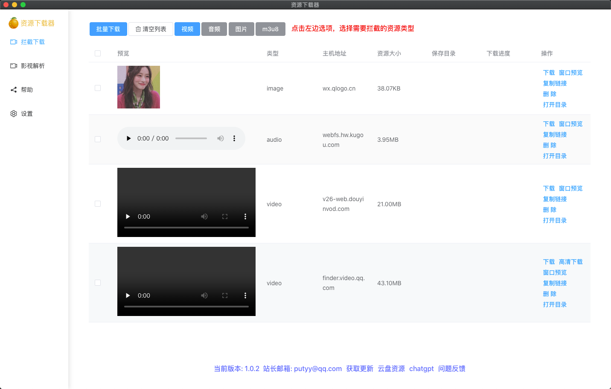

# res-downloader

🎯 基于 [electron-vite-vue](https://github.com/electron-vite/electron-vite-vue.git)  
📦 操作简单、可获取不同类型的资源  
💪 支持获取视频、音频、图片、m3u8  
🖥 支持获取视频号、抖音、快手、小红书、酷狗音乐、qq音乐等网络资源  

## 软件下载
🆕 [github下载](https://github.com/putyy/res-downloader/releases)  
🆕 [蓝奏云下载 密码:9vs5](https://wwjv.lanzoum.com/b04wgtfyb)


## 二次开发
```sh
git clone https://github.com/putyy/res-downloader

cd res-downloader

yarn install

yarn run dev

# 打包mac
yarn run build --mac

# 打包win
yarn run build --win
```

## 软件截图


## 实现原理
> 通过代理网络抓包拦截响应，筛选出有用的资源，同fiddler、charles等抓包软件、浏览器F12打开控制也能达到目的，只不过这些软件需要手动进行筛选，对于小白用户上手还是有点难度，所以就有了本项目这样的软件。


## 参考项目

- [WeChatVideoDownloader](https://github.com/lecepin/WeChatVideoDownloader) 原项目是react写的，本项目参考原项目用vue3重写了一下，核心逻辑没什么变化，主要是增加了一些新的功能，再次感谢！
