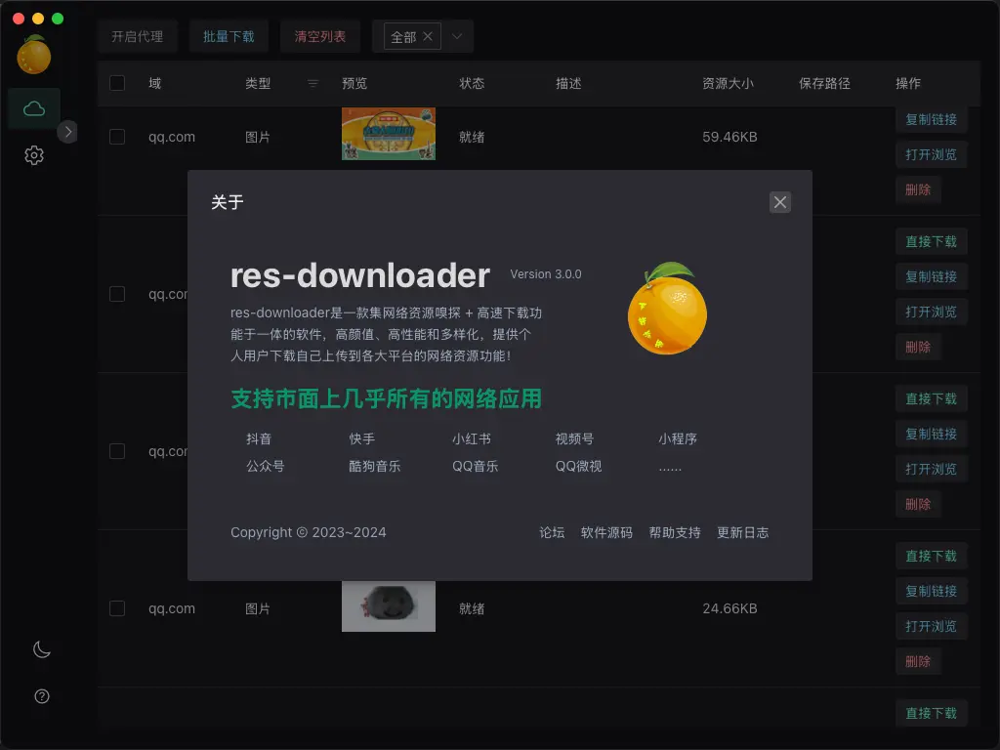

# res-downloader
### 🎉 爱享素材下载器

> 一款基于 Go + [Wails](https://github.com/wailsapp/wails) 的跨平台资源下载工具，简洁易用，支持多种资源嗅探与下载。

### 📖 中文 | [English](./README-EN.md)

---

## ✨ 功能特色

- 🚀 **简单易用**：操作简单，界面清晰美观
- 🖥️ **多平台支持**：Windows / macOS / Linux
- 🌐 **多资源类型支持**：视频 / 音频 / 图片 / m3u8 / 直播流等
- 📱 **平台兼容广泛**：支持微信视频号、小程序、抖音、快手、小红书、酷狗音乐、QQ音乐等
- 🌍 **代理抓包**：支持设置代理获取受限网络下的资源

---

## 📚 文档 & 版本

- 📘 [在线文档](https://res.putyy.com/)
- 🧩 [Mini版 UI使用默认浏览器展示](https://github.com/putyy/res-downloader) ｜ [Electron旧版 支持Win7](https://github.com/putyy/res-downloader/tree/old)
- 💬 [加入交流群](https://www.putyy.com/app/admin/upload/img/20250418/6801d9554dc7.webp)
  > *群满时可加微信 `AmorousWorld`，请备注“来源”*

---

## 🧩 下载地址

- 🆕 [GitHub 下载](https://github.com/putyy/res-downloader/releases)
- 🆕 [蓝奏云下载（密码：9vs5）](https://wwjv.lanzoum.com/b04wgtfyb)
- ⚠️ *Win7 用户请下载 `2.3.0` 版本*

---

## 🚀 使用方法

> 请按以下步骤操作以正确使用软件：

1. 安装时务必 **允许安装证书文件** 并 **允许网络访问**
2. 打开软件 → 首页左上角点击 **“启动代理”**
3. 选择要获取的资源类型（默认全部）
4. 在外部打开资源页面（如视频号、小程序、网页等）
5. 返回软件首页，即可看到资源列表

---

## 🖼️ 软件截图

---

## ❓ 常见问题

### 📺 m3u8 视频资源

- 在线预览：[m3u8play](https://m3u8play.com/)
- 视频下载：[m3u8-down](https://m3u8-down.gowas.cn/)

### 📡 直播流资源

- 推荐使用 [OBS](https://obsproject.com/) 进行录制（教程请百度）

### 🐢 下载慢、大文件失败？

- 推荐工具：
  - [Neat Download Manager](https://www.neatdownloadmanager.com/index.php/en/)
  - [Motrix](https://motrix.app/download)
- 视频号资源下载后可在操作项点击 `视频解密（视频号）`

### 🧩 软件无法拦截资源？

- 检查是否正确设置系统代理：  
  地址：127.0.0.1
  端口：8899

### 🌐 关闭软件后无法上网？

- 手动关闭系统代理设置

### 🧠 更多问题

- [GitHub Issues](https://github.com/putyy/res-downloader/issues)
- [爱享论坛讨论帖](https://s.gowas.cn/d/4089)

---

## 💡 实现原理 & 初衷

本工具通过代理方式实现网络抓包，并筛选可用资源。与 Fiddler、Charles、浏览器 DevTools 原理类似，但对资源进行了更友好的筛选、展示和处理，大幅度降低了使用门槛，更适合大众用户使用。

---

## ⚠️ 免责声明

> 本软件仅供学习与研究用途，禁止用于任何商业或违法用途。  
如因此产生的任何法律责任，概与作者无关！
