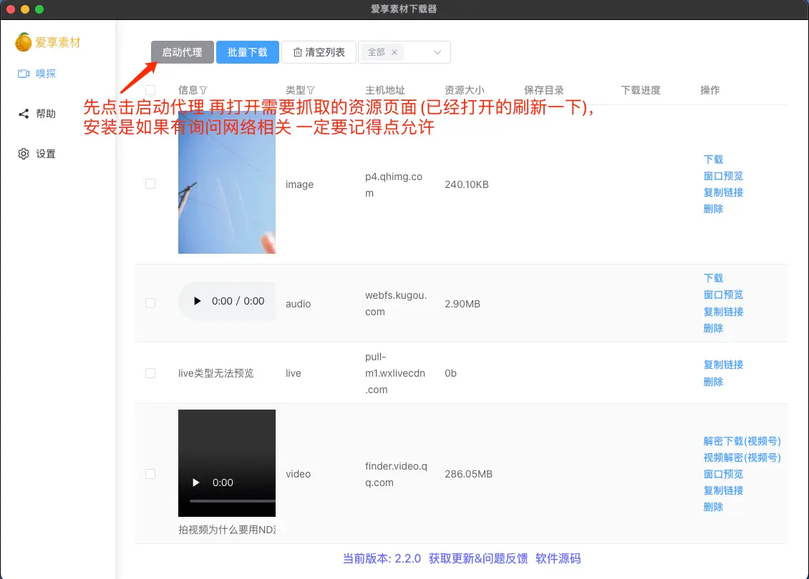

# res-downloader

🎯 基于 [electron-vite-vue](https://github.com/electron-vite/electron-vite-vue.git)  
📦 操作简单、可获取不同类型的资源  
💪 支持获取视频、音频、图片、m3u8
🖥 支持获取视频号、抖音、快手、小红书、酷狗音乐、qq音乐、微信小程序等网络资源  
🍊 支持设置代理以获取特殊网络下的资源

## 软件下载
🆕 [github下载](https://github.com/putyy/res-downloader/releases)  
🆕 [蓝奏云下载 密码:9vs5](https://wwjv.lanzoum.com/b04wgtfyb)


## 二次开发
> ps： 打包慢的问题可以参考 https://www.putyy.com/articles/87
```sh
git clone https://github.com/putyy/res-downloader

cd res-downloader

yarn install

yarn run dev

# 打包mac
yarn run build --universal --mac

# 打包win
yarn run build --win
```

## 使用方法
> 1. 打开本软件
> 2. 软件首页选择要获取的资源类型（默认选中的视频）
> 3. 打开要捕获的源， 如：视频号、网页、小程序等等
> 4. 返回软件首页即可看到要下载的资源

## 常见问题
> 1. 无法拦截获取
> > 手动检测系统代理是否设置正确 本软件代理地址: 127.0.0.1:8899
> 2. 关闭软件后无法正常上网
> > 手动关闭系统代理设置
> 3. 视频号抓取流程
> > 将需要下载的视频发给好友或者文件助手 再打开即可拦截，通常会出现解密下载按钮
> >
> > 大视频可以复制链接通过其他工具加速下载，然后再通过对应的视频操作项进行"视频解密"

## 软件截图


## 实现原理
> 通过代理网络抓包拦截响应，筛选出有用的资源，同fiddler、charles等抓包软件、浏览器F12打开控制也能达到目的，只不过这些软件需要手动进行筛选，对于小白用户上手还是有点难度，所以就有了本项目这样的软件。

## 参考项目

- [WeChatVideoDownloader](https://github.com/lecepin/WeChatVideoDownloader) 原项目是react写的，本项目参考原项目用vue3重写了一下，核心逻辑没什么变化，主要是增加了一些新的功能，再次感谢！

