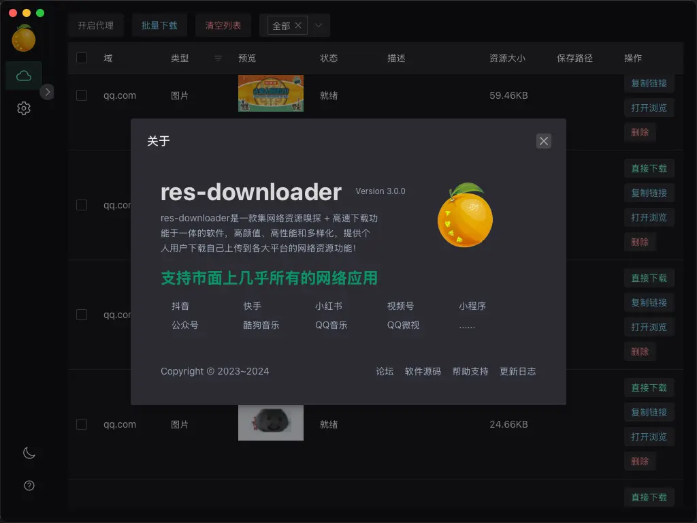

<div align="center">

<a href="https://github.com/putyy/res-downloader"></a>
<h1>res-downloader</h1>
<h4>📖 中文 | <a href="https://github.com/putyy/res-downloader/blob/master/README-EN.md">English</a></h4>

[](https://github.com/putyy/res-downloader/stargazers)
[](https://github.com/putyy/res-downloader/fork)
[](https://github.com/putyy/res-downloader/releases)

[](https://github.com/putyy/res-downloader/blob/master/LICENSE)

</div>

---
## 📢 项目状态

首先感谢大家对本项目的关注和支持 ❤️

由于个人事务原因，近期能够投入到项目维护的时间比较有限，因此Issue回复、PR Review以及版本发布的速度可能会比以前慢一些。

在此欢迎社区开发者一起参与建设，如果你在使用过程中发现问题，或者有功能改进建议，欢迎提交Issue；如果愿意贡献代码，也非常欢迎提交 Pull Request。

提交代码前请阅读：
[Contributing Guide](./CONTRIBUTING.md)

非常感谢每一位使用者、反馈者和贡献者的支持！！！


### 🎉 爱享素材下载器

> 一款基于 Go + [Wails](https://github.com/wailsapp/wails) 的跨平台资源下载工具，简洁易用，支持多种资源嗅探与下载。

## ✨ 功能特色

- 🚀 **简单易用**：操作简单，界面清晰美观
- 🖥️ **多平台支持**：Windows / macOS / Linux
- 🌐 **多资源类型支持**：视频 / 音频 / 图片 / m3u8 / 直播流等
- 📱 **平台兼容广泛**：支持微信视频号、小程序、抖音、快手、小红书、酷狗音乐、QQ音乐等
- 🌍 **代理抓包**：支持设置代理获取受限网络下的资源

## 📚 文档 & 版本

- 📘 [在线文档](https://res.putyy.com/)
- 💬 [加入交流群](https://www.putyy.com/app/admin/upload/img/20250418/6801d9554dc7.webp)
- 🧩 [最新版](https://github.com/putyy/res-downloader/releases) ｜ [Mini版 使用默认浏览器展示UI](https://github.com/putyy/resd-mini) ｜ [Electron旧版 支持Win7](https://github.com/putyy/res-downloader/tree/old)
  > *群满时可加微信 `AmorousWorld`，请备注“github”*

## 🧩 下载地址

- 🆕 [GitHub 下载](https://github.com/putyy/res-downloader/releases)
- 🆕 [蓝奏云下载（密码：9vs5）](https://wwjv.lanzoum.com/b04wgtfyb)
- ⚠️ *Win7 用户请下载 `2.3.0` 版本*


## 🖼️ 预览


--- 

## 🚀 使用方法

> 请按以下步骤操作以正确使用软件：

1. 安装时务必 **允许安装证书文件** 并 **允许网络访问**
2. 打开软件 → 首页左上角点击 **“启动代理”**
3. 选择要获取的资源类型（默认全部）
4. 在外部打开资源页面（如视频号、小程序、网页等）
5. 返回软件首页，即可看到资源列表

## 🛠️ 本地开发

桌面端使用 Go + Wails v2.12.0，`frontend/` 使用 Vue 3 + TypeScript + Vite。请在包含 `wails.json` 的项目根目录执行 Wails 命令。

### 环境准备

- Go 1.23.2 或更新版本（`go.mod` 声明 Go 1.22.0，工具链为 `go1.23.2`）。macOS 15 及以上请使用 Go 1.23.3 或更新版本。
- Node.js 和 npm。项目 Linux 构建镜像使用 Node.js 20；锁定的前端依赖至少需要 Node.js 18.12。
- 系统依赖：macOS 安装 Xcode Command Line Tools（`xcode-select --install`）；Windows 安装 WebView2 Runtime；Linux 安装 C 编译器、GTK3 和 WebKitGTK 开发包。具体步骤见 [Wails 安装文档](https://wails.io/docs/gettingstarted/installation/)。

安装与 `go.mod` 一致的 Wails CLI 版本，并检查环境：

```sh
go install github.com/wailsapp/wails/v2/cmd/wails@v2.12.0
wails doctor
```

如果提示找不到 `wails`，请将 Go 的二进制目录加入 `PATH`（macOS/Linux 通常为 `~/go/bin`，Windows 通常为 `%USERPROFILE%\go\bin`）。macOS/Linux 使用默认 Go 二进制目录时可执行：

```sh
export PATH="$PATH:$(go env GOPATH)/bin"
```

### 启动开发模式

```sh
git clone https://github.com/putyy/res-downloader.git
cd res-downloader
wails dev
```

已有本地代码时，直接在项目根目录执行 `wails dev`。Wails 会使用 [`wails.json`](./wails.json) 中的配置：

| 配置项 | 命令 / 行为 |
| --- | --- |
| `frontend:install` | 需要安装依赖时，在 `frontend/` 执行 `npm install` |
| `frontend:dev:watcher` | 执行 `npm run dev` 启动 Vite |
| `frontend:dev:serverUrl` | `auto` 自动识别 Vite 开发地址 |
| `frontend:build` | 执行 `npm run build`，检查 TypeScript 并构建前端资源 |

在启动的桌面窗口中调试。修改前端会触发热更新，修改 Go 代码会触发重新构建并重启应用。单独运行 Vite 不会启动应用所需的 Go 后端。更多开发参数见 [Wails CLI 文档](https://wails.io/docs/reference/cli/)。

Linux 使用 WebKitGTK 4.1 时，开发和构建命令均需添加以下标签：

```sh
wails dev -tags webkit2_41
wails build -tags webkit2_41
```

### 构建与检查

```sh
# 在项目根目录执行：仅检查类型并构建前端
npm --prefix frontend ci
npm --prefix frontend run build

# 构建当前平台的桌面应用
wails build
```

桌面构建产物位于 `build/bin/`。各平台安装包及发布打包步骤见 [打包文档](./build/README.md)。

后端代码位于 `core/`，桌面入口为 `main.go`，界面代码位于 `frontend/src/`。`frontend/wailsjs/` 中的 Go/JavaScript 绑定由 Wails 生成；修改 Go 方法后通过 Wails 重新生成，不要手动编辑绑定文件。提交 PR 前请阅读 [贡献指南](./CONTRIBUTING.md)。

## ❓ 常见问题

### 📺 m3u8 视频资源

- 在线预览：[m3u8play](https://m3u8play.com/)
- 视频下载：[m3u8-down](https://m3u8-down.gowas.cn/)

### 📡 直播流资源

- 推荐使用 [OBS](https://obsproject.com/) 进行录制（教程请百度）

### 🐢 下载慢、大文件失败？

- 推荐工具：
  - [Neat Download Manager](https://www.neatdownloadmanager.com/index.php/en/)
  - [Motrix](https://motrix.app/download)
- 视频号资源下载后可在操作项点击 `视频解密（视频号）`

### 🧩 软件无法拦截资源？

- 检查是否正确设置系统代理：  
  地址：127.0.0.1
  端口：8899

### 🌐 关闭软件后无法上网？

- 手动关闭系统代理设置

### 🧠 更多问题

- [GitHub Issues](https://github.com/putyy/res-downloader/issues)
- [爱享论坛讨论帖](https://s.gowas.cn/d/4089)

## 💡 实现原理 & 初衷

本工具通过代理方式实现网络抓包，并筛选可用资源。与 Fiddler、Charles、浏览器 DevTools 原理类似，但对资源进行了更友好的筛选、展示和处理，大幅度降低了使用门槛，更适合大众用户使用。

---

## ⚠️ 免责声明

> 本软件仅供学习与研究用途，禁止用于任何商业或违法用途。  
如因此产生的任何法律责任，概与作者无关！
