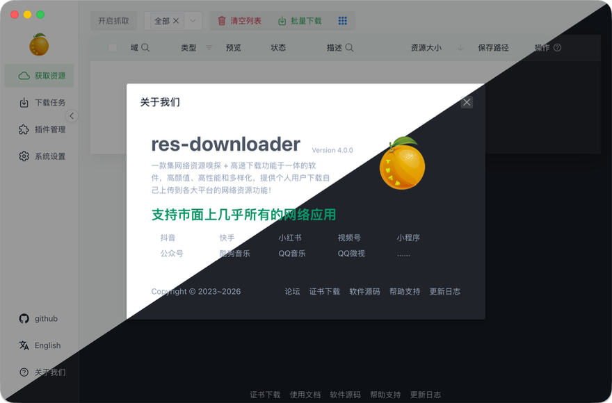

<h1>res-downloader</h1>
<h4>📖 中文 | <a href="https://github.com/putyy/res-downloader/blob/master/README-EN.md">English</a></h4>

---
## 📢 项目状态

首先感谢大家对本项目的关注和支持 ❤️

由于个人事务原因，近期能够投入到项目维护的时间比较有限，因此Issue回复、PR Review以及版本发布的速度可能会比以前慢一些。

在此欢迎社区开发者一起参与建设，如果你在使用过程中发现问题，或者有功能改进建议，欢迎提交Issue；如果愿意贡献代码，也非常欢迎提交 Pull Request。

提交代码前请阅读：
[Contributing Guide](./CONTRIBUTING.md)

非常感谢每一位使用者、反馈者和贡献者的支持！！！

### 🎉 爱享素材下载器

> 一款简洁易用的跨平台资源发现与下载工具，支持多种资源抓取、预览和下载方式。

## ✨ 功能特色

- 🚀 **简单易用**：操作简单，界面清晰美观
- 🖥️ **多平台支持**：Windows / macOS / Linux
- 🌐 **多资源类型支持**：视频 / 音频 / 图片 / M3U8 / 直播流等
- 📱 **站点适配**：预装微信视频号插件，抖音等站点可通过插件商店扩展
- 🌍 **网络抓取**：支持捕获浏览器、手机和桌面应用中的 HTTP / HTTPS 资源
- 🧩 **插件扩展**：可以为更多站点增加专用识别、下载和处理能力
- 📥 **任务中心**：独立管理下载进度、暂停、继续、取消、重试和历史记录
- 📡 **HLS 与直播**：支持 M3U8 点播预览与下载，配置 FFmpeg 后可以录制直播

## 📚 文档 & 版本

- 📘 [在线文档](https://res.putyy.com/)
- 🧩 [插件管理](./docs/plugin-management.md)
- 🛠️ [插件开发](./docs/plugins.md)
- 🤝 [参与贡献](./docs/contributing.md)
- 💬 [加入交流群](https://www.putyy.com/app/admin/upload/img/20250418/6801d9554dc7.webp)
- 🧩 [版本发布](https://github.com/putyy/res-downloader/releases) ｜ [Mini 版](https://github.com/putyy/resd-mini) ｜ [旧版归档](https://github.com/putyy/res-downloader/tree/old)
  > *群满时可加微信 `AmorousWorld`，请备注“github”*

## 🧩 下载地址

- 🆕 [GitHub 下载](https://github.com/putyy/res-downloader/releases)
- 🆕 [蓝奏云下载（密码：9vs5）](https://wwjv.lanzoum.com/b04wgtfyb)
- ⚠️ *Windows 7 仅可使用旧版归档中的 `2.3.0`，不支持当前版本功能。*

## 🖼️ 预览

--- 

## 🚀 使用方法

> 请按以下步骤操作以正确使用软件：

1. 安装并启动软件，按系统提示允许必要的网络访问。
2. 打开 **系统设置 → 证书**，安装当前设备证书。
3. 返回“获取资源”页面，点击 **开启抓取**。
4. 选择抓取类型，然后在浏览器、手机或桌面应用中访问目标内容。
5. 返回资源列表下载；已创建的任务可在“下载任务”页面管理。

## ❓ 常见问题

### 📺 HLS / M3U8 视频资源

- 软件内置 HLS 预览和下载，支持相对分片地址、Master Playlist、AES Key 和原请求 Header。

### 📡 直播流资源

- HLS / FLV 直播可直接预览；配置用户自行安装的 FFmpeg 后可录制并“停止并保存”。

### 🔐 微信视频号加密资源

- 使用软件内置下载时会自动执行插件处理链。通过复制链接和其他工具下载的加密文件，可在对应资源的操作菜单中选择“解密本地视频”。

### 🧩 软件无法拦截资源？

- 确认证书状态正常并已点击“开启抓取”。默认代理为 `127.0.0.1:8899`，修改过监听设置时以“系统设置”中的值为准。

### 🌐 关闭软件后无法上网？

- 应用正常退出时会关闭其管理的系统代理；如果进程异常退出，请在系统网络设置中手动关闭代理。

### 🧠 更多问题

- [GitHub Issues](https://github.com/putyy/res-downloader/issues)
- [爱享论坛讨论帖](https://s.gowas.cn/d/4089)

## 💡 工作原理与初衷

本工具通过本地代理发现网络请求中的可用资源。它提供更直观的筛选、预览和下载操作，降低普通用户管理网页资源的门槛。开发者可以查看[架构文档](./docs/architecture.md)了解内部组成。

---

## ⚠️ 免责声明

> 本项目依据 [Apache License 2.0](./LICENSE) 发布，详情请参阅 LICENSE。

使用者应确保对所处理的资源拥有合法权利，并遵守所在地法律、平台协议及相关版权规定。软件按“现状”提供，使用风险由使用者自行承担，具体以 Apache License 2.0 的免责声明和责任限制为准。

## ©️ 版权与品牌

Copyright © 2023–present putyy and res-downloader contributors.

Apache License 2.0 不授予以项目官方、合作或背书名义使用 `res-downloader` 名称和项目 Logo 的权利。合理说明软件来源不受影响，详情见 [NOTICE](./NOTICE)。
