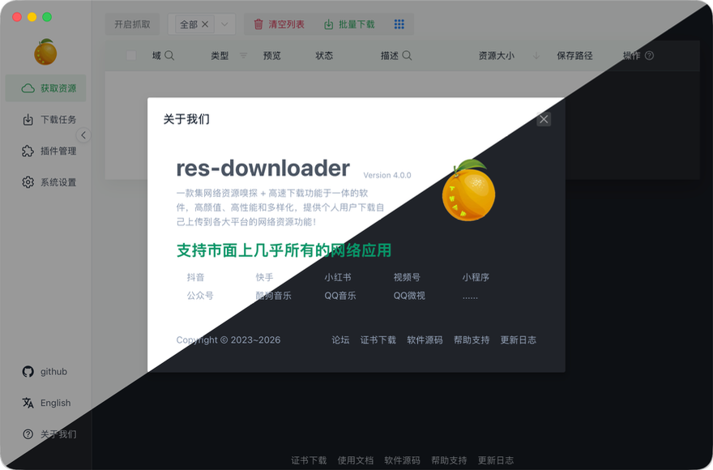

<h1>res-downloader</h1>
<h4>📖 中文 | <a href="https://github.com/putyy/res-downloader/blob/master/README-EN.md">English</a></h4>

---

### 🎉 爱享素材下载器

> 一款简洁易用的跨平台资源发现与下载工具，支持多种资源抓取、预览和下载。

## ✨ 功能特色

- 🪄 **简单易用**：操作简单，界面清晰美观
- 💻 **多平台支持**：Windows / macOS / Linux
- 🎞️ **多资源类型支持**：视频 / 音频 / 图片 / M3U8 / 直播流等
- 📱 **站点适配**：预装微信视频号插件，抖音等站点可通过插件商店扩展
- 🌐 **网络抓取**：支持捕获浏览器、手机和桌面应用中的 HTTP / HTTPS 资源
- 🧩 **插件扩展**：可以为更多站点增加专用识别、下载和处理能力
- 📥 **任务中心**：独立管理下载进度、暂停、继续、取消、重试和历史记录
- 🤖 **CLI / MCP**：通过命令或 Agent 查询已抓取资源、创建下载和管理任务，需要桌面应用保持运行
- 📡 **HLS 与直播**：支持 M3U8 点播预览与下载，配置 FFmpeg 后可以录制直播

## 📚 文档 & 版本

- [在线文档](https://res.putyy.com/)
- [CLI 与 MCP](./docs/zh/guide/automation.md)
- [插件管理](./docs/zh/guide/plugin-management.md)
- [插件开发](./docs/zh/development/plugins.md)
- [参与贡献](./docs/zh/development/contributing.md)
- [常见问题](./docs/zh/guide/troubleshooting.md)
- [版本发布](https://github.com/putyy/res-downloader/releases) ｜ [Mini 版](https://github.com/putyy/resd-mini) ｜ [旧版归档](https://github.com/putyy/res-downloader/tree/old)
  > *加满可添加微信 AmorousWorld，由维护者邀请加入交流群 `AmorousWorld`，请备注“github”*

## 🧩 下载地址

- [GitHub 下载](https://github.com/putyy/res-downloader/releases)
- [蓝奏云下载（密码：9vs5）](https://wwjv.lanzoum.com/b04wgtfyb)
- *Windows 7 仅可使用旧版归档中的 `2.3.0`，不支持当前版本功能。*

## 💡 工作原理与初衷

本工具通过本地代理发现网络请求中的可用资源。它提供更直观的筛选、预览和下载操作，降低普通用户管理网页资源的门槛。开发者可以查看[架构文档](./docs/zh/development/architecture.md)了解内部组成。

---

## ⚠️ 免责声明

> 本项目依据 [Apache License 2.0](./LICENSE) 发布，详情请参阅 LICENSE。

使用者应确保对所处理的资源拥有合法权利，并遵守所在地法律、平台协议及相关版权规定。软件按“现状”提供，使用风险由使用者自行承担，具体以 Apache License 2.0 的免责声明和责任限制为准。

## ©️ 版权与品牌

Copyright © 2023–present putyy and res-downloader contributors.

Apache License 2.0 不授予以项目官方、合作或背书名义使用 `res-downloader` 名称和项目 Logo 的权利。合理说明软件来源不受影响，详情见 [NOTICE](./NOTICE)。
