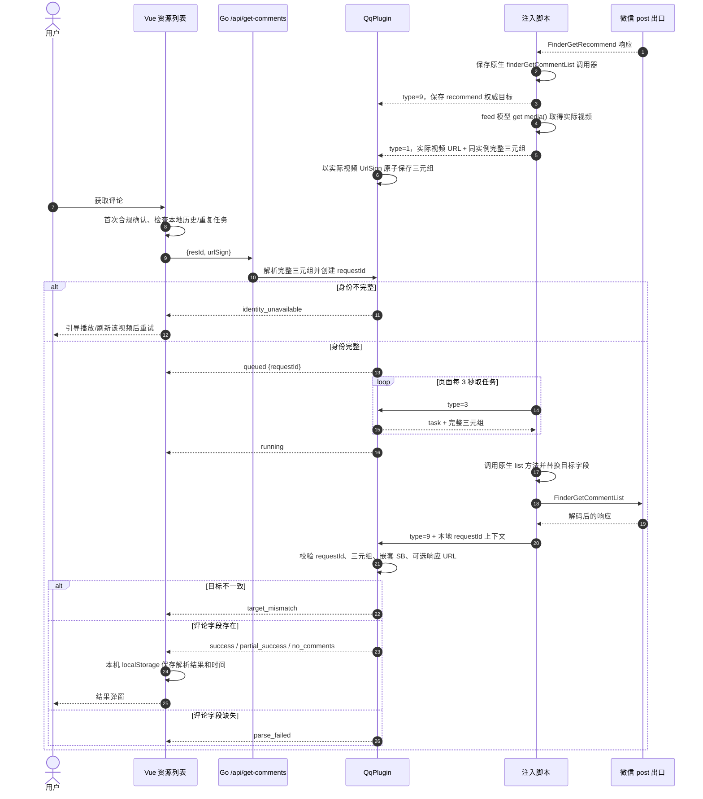
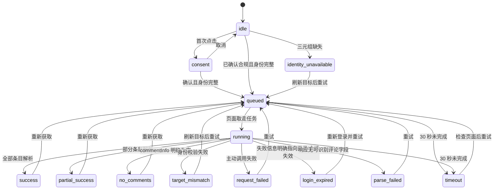

# 微信视频号评论抓取：技术判断与交互设计

> 文档状态：真实环境终验（2026-09-02，微信 4.1.11）
> 适用范围：资源列表中的“获取评论”任务，不改变下载、预览、解密和资源嗅探能力。
> 权威上下文：[`wechat-comment-fetch-context.md`](./wechat-comment-fetch-context.md)。本文不覆盖其中的逆向事实，只把当前判断落实为可执行设计。

## 1. 结论先行

第 9 版的请求与校验链路已经通过真实环境验证。剩余的 `identity_unavailable` 根因不是微信未返回身份，而是微信 4.1.11 的 recommend 响应只给出 20304 封面 URL，下载列表使用 `get media()` 产生的 20302 视频 URL；旧实现只把完整三元组绑定到封面 `UrlSign`，所以用户点击实际视频行时无法命中。

最新 bundle 提供了更短且不需要猜测的关联点：唯一一个 `get media()` 位于 feed 模型类，`this` 同时直接持有 `id`、`objectNonceId`、`sessionBuffer` 和 `objectDesc`。当前实现从该同一实例原子回传完整三元组，并绑定到 getter 中的实际视频 URL；不再扫描组件字段。`post` 总出口继续负责捕获推荐/评论请求响应，并在首次 `FinderGetRecommend` 时保存原生 `finderGetCommentList` 方法，因此用户点击视频即可自动请求评论，不需要先手动展开一次评论区。

2026-09-02 的客户端升级没有改变上述身份模型，但改变了两个兼容表象：`post()` 的 catch 枚举名从 `Ce.JSAPI_UNKNOWN` 变为 `JstransferErr.JSAPI_UNKNOWN`，媒体 CDN 出现 `findera4.video.qq.com:443`。注入因此只锚定 `post -> invoke` 稳定前缀并保留原 catch；资源入口限定识别 `finder*.video.qq.com` 且忽略显式端口。两处均为兼容层修复，不放宽三元组校验。

## 2. 证据分层

### 2.1 已证实

| 结论 | 证据 | 设计约束 |
|---|---|---|
| `post` 是当前最佳出口 | 样本 bundle 中正则命中 2 个客户端；历史日志持续出现 `post hook recommend` | 推荐、评论请求与响应统一在 post 层观测 |
| 服务端定位依赖 `sessionBuffer` | 同 nonce、不同 buffer 返回不同视频；手动请求含 `objectBaseInfos[0].sessionBuffer` | 缺 SB 不发送主动请求 |
| feed 有同源三元组 | bundle feed model、`toggleLikeFeed` 与 recommend 响应结构 | 三字段必须原子存储，禁止跨来源拼接 |
| 实际视频可从 feed 模型原子取得三元组 | bundle 的唯一 `get media()` 与 `id/objectNonceId/sessionBuffer` 位于同一类；真实日志出现 `media_identity_linked source=feed_model` | 实际视频 URL 直接绑定同实例三元组，不做 URL/描述猜测 |
| 组件 nonce 与 type=6 会错配 | 失败轮次 5、7、8 | 仅保留兼容接收，不参与主动任务身份选择 |
| `objectDesc` 无可靠目标 ID | bundle 与真实字段日志 | 不从 objectDesc 猜 ID |
| 手动请求和构造请求存在可比较入口 | type=9 已记录 post 完整参数 | 只有完整三元组仍失败时才做结构化 diff |
| 自动评论链路已成功返回有评论结果 | 实测实际视频“暴躁主厨第二弹”：`task_queued → task_picked → request_verified → task_completed status=success` | 25 条评论进入结果弹窗，无需预先手动打开评论区 |

### 2.2 仍待真实环境验证

- 再选择一条明确有评论的不同动态，与微信原生首屏逐项对照，确认跨目标结果不串。
- 首屏之后的分页 `lastBuffer` 仍未实现。
- 微信下次升级后，唯一 `get media()` 是否仍位于持有三元组的 feed 模型，需要由 bundle 静态测试继续守护。

以上均是待验证假设，不在实现中通过“多塞字段”提前假定。

## 3. 失败点排序

| 排名 | 失败点 | 概率 | 影响 | 当前处理 |
|---|---|---:|---:|---|
| 1 | 旧缓存视频未在当前页面重新建立 feed 模型映射 | 中 | 阻断 | 当前页面播放/刷新后由 getter 原子补齐；仍缺失才返回“身份未就绪” |
| 2 | 旧实现把不同来源的非空字段合并成伪三元组 | 高 | 串视频 | 完整 feed 三元组原子覆盖；不完整上报不能污染完整值 |
| 3 | 构造请求仍残留模板目标字段或嵌套 SB 不一致 | 中 | 串视频 | 发送前覆盖，post 回传后逐项校验，不一致即丢弃 |
| 4 | recommend 的 SB 不是评论上送定位值 | 中 | 请求失败/错目标 | 真实失败后执行排查方向 1、3，再做同视频 diff |
| 5 | 还存在未识别的上下文字段依赖 | 中低 | 请求失败 | 按方向 2、4 对同一视频做最小差异修复 |
| 6 | UI 把空评论当超时、静默丢弃错配或重复提交 | 已发生 | 误导用户 | 拆分状态、显式恢复动作、前后端双重去重 |
| 7 | 新 CDN 主机或 `:443` 使资源入口判断失配 | 已发生 | 入口隐藏 | 前后端统一受限的 `finder*.video.qq.com` 识别并规范化端口 |

## 4. 技术调用链



### 4.1 请求构造硬约束

- 身份只允许来自单个 feed 的同源字段：实际视频使用 feed 模型自身的精确字段，封面兼容目标使用单个 recommend 条目。
- type=1 必须带 `identitySource=feed_model` 且三元组完整；旧组件扫描或缺字段上报不能进入可用映射。
- 发送前必须同时存在 `objectid`、`objectNonceId`、`sessionBuffer`。
- 顶层 `sessionBuffer` 和 `finderBasereq.objectBaseInfos[0].sessionBuffer` 都替换为目标值。
- `lastBuffer` 只用于分页；首屏主动请求删除模板遗留值。
- 其他模板字段原样保留，不根据猜测新增。
- `requestId/resId/urlSign` 只保存在页面本地上下文并随 type=9 回传，不发送给微信接口。

## 5. 页面状态模型



| 状态 | 用户文案 | 主操作 | 是否保存历史 |
|---|---|---|---|
| idle | 获取评论 | 获取评论 | 否 |
| consent | 评论包含他人昵称、IP 属地和内容，仅在本机保存。请确认你有权采集和使用。 | 继续获取 / 取消 | 仅保存“已确认”标记 |
| queued | 已加入队列，等待视频号页面响应… | 禁止重复提交 | 否 |
| running | 正在校验目标并获取评论… | 禁止重复提交 | 否 |
| success | 已获取 {count} 条评论 | 查看详情 / 重新获取 | 是 |
| partial_success | 已获取 {count} 条，部分内容未能解析 | 查看详情 / 重新获取 | 是 |
| no_comments | 该视频暂未返回评论 | 关闭 / 重新获取 | 保存空结果与时间 |
| identity_unavailable | 尚未获取到该视频的完整身份信息 | 去视频号播放或刷新后重试 | 否 |
| timeout | 等待超时，视频号页面可能未打开或仍使用旧脚本 | 检查页面 / 重试 | 否 |
| target_mismatch | 目标校验未通过，已阻止展示可能错配的评论 | 刷新目标 / 重试 | 否 |
| request_failed | 评论请求失败 | 重试 | 否 |
| login_expired | 微信登录可能已失效 | 重新登录 / 重试 | 否 |
| parse_failed | 收到响应，但暂时无法识别评论格式 | 重试；调试日志供排查 | 否 |

“登录失效”只能由明确错误特征推断；否则统一归为“请求失败”，不得向用户断言。

## 6. 关键组件与布局

### 6.1 视觉方向

- 沿用现有系统字体、Naive UI 控件、圆形操作图标和明暗主题，不引入新字体或全局色板。
- 评论主色继续使用紫色 `#8B5CF6`；成功 `#10B981`、提醒 `#F59E0B`、错误 `#EF4444`、辅助信息 `#64748B`，实际渲染优先使用 Naive UI 语义 token。
- 标志性元素是“目标已校验”状态章：三个小节点汇入一个对勾，只表达校验完成，不展示 objectId、nonce 或 SB。
- 动效只用于排队/执行中的单个旋转指示；遵循 `prefers-reduced-motion`，不增加装饰动画。

第一次构想中的“独立评论管理页”会破坏现有资源列表心智模型，且为少量历史记录引入过多导航；最终改为入口状态化 + 结果弹窗，历史仍挂载在资源行上。

### 6.2 桌面与窄屏线框

```text
资源行 · 更多操作                     评论结果弹窗（桌面 ≤ 720px）
┌───────────────────────┐             ┌──────────────────────────────────┐
│ ◉ 获取评论             │             │ 评论列表        [✓ 目标已校验] │
│ ◌ 等待页面…（禁用）    │  ───────▶   │ 视频标题 · 25 条 · 获取时间      │
│ ✓ 查看评论（25）       │             │ ─────────────────────────────── │
└───────────────────────┘             │ 昵称 · IP属地          👍 12     │
                                      │ 评论正文                         │
                                      │ ─────────────────────────────── │
                                      │ 本结果仅保存在本机               │
                                      │      [重新获取] [关闭]           │
                                      └──────────────────────────────────┘

窄屏：弹窗宽度 calc(100vw - 24px)，页脚按钮不低于 40px；评论元信息允许换行，正文不断字溢出。
```

### 6.3 组件职责

| 组件 | 职责 |
|---|---|
| `Action.vue` | 根据资源评论状态显示“获取/等待/查看”，活动态禁用并提供 `aria-label` |
| `index.vue` | 提供常驻工具栏入口；负责资源选择、合规确认、API 调用、事件状态归并、超时、历史持久化和恢复动作 |
| `CommentsDialog.vue` | 成功/部分成功/无评论的详情层级、重新获取、关闭、响应式与焦点管理 |
| `QqPlugin` | 原子身份、任务生命周期、post 关联、请求校验、解析和脱敏诊断 |

## 7. 用户路径与异常恢复

1. 用户可点击顶部常驻“获取评论”，或在视频号资源的“更多操作”中点击“获取评论”。顶部入口在空列表时提示先开启抓取；仅有一个视频号资源时直接使用它；多个资源时要求先勾选一个。
   微信 4.1.11 的实际视频行会由 feed 模型直接绑定评论身份；recommend 封面仍作为兼容评论目标保留，但用户通常无需再选择该图片载体。
2. 首次使用先看到合规确认；取消后不创建任务。
3. 身份完整时按钮变为“等待页面…”，页面取走后变为“正在获取…”。同资源不能重复创建任务。
4. 完成后弹窗自动打开；关闭后入口显示“查看评论（N）”，再次点击直接读取本机历史。
5. 弹窗“重新获取”创建新任务并在成功时覆盖该资源的旧历史；旧历史在新任务失败时仍保留。
6. 空评论是有效完成，不显示原始 JSON；解析失败与内部结构只写脱敏调试日志。
7. 清空或删除资源时，随资源一并删除本机评论历史。
8. 应用重启后若历史里残留 `queued/running`，改为“上次任务已中断”，允许重试。

## 8. 可访问性

- 评论入口使用原生按钮语义，活动态设置 `disabled` 与 `aria-busy`；状态变化通过现有消息系统及 `aria-live=polite` 内容反馈。
- 弹窗打开后焦点进入标题/关闭按钮，焦点限制在弹窗内；Esc 关闭，关闭后由 Naive UI 恢复触发点焦点。
- 所有操作可用键盘触发；状态不能只靠颜色表达，图标旁保留文字。
- 评论列表使用语义化列表/文章结构；昵称、地区、点赞、回复数和时间有文字标签。
- 触控目标不小于 40px；窄屏正文可换行，滚动区保留可见焦点轮廓。

## 9. 调试与数据边界

- 普通用户可见：阶段、可恢复原因、评论条数和获取时间。
- 内部日志可见：阶段码、字段是否存在、字段长度、短哈希、响应键名和解析计数。
- 禁止记录或展示：完整 objectId、nonce、sessionBuffer、完整 post 参数、评论正文、昵称或完整原始响应。
- 评论解析结果和获取时间仅保存在 Wails WebView 的 `localStorage`，不上传、不写独立服务端数据库；删除/清空资源会删除对应记录。
- 抓取前首次明确告知数据类型和本地保存范围。使用者负责取得必要授权并遵守平台规则与适用法律。

## 10. 最短真实验证路径

1. 构建并启动新产物，确认代理和 CA 状态正常。
2. **Cmd+Q 完全退出微信后重开**，进入视频号；否则旧 WebView 注入缓存会污染结论。
3. 观察脱敏日志出现 `hook_injected post_matches=2`、`identity_batch ... complete>0` 和 `media_identity_linked source=feed_model`。
4. 选择刚在视频号中出现/播放的实际视频行并点击“获取评论”，无需先打开微信原生评论区。
5. 必须依次出现：`task_queued hasTriple=true` → `task_picked` → `request_verified` → `task_completed`。
6. 打开该视频原生评论区，对比首屏昵称/内容与应用结果；再选另一视频重复，确认结果不串。
7. 分别检查：有评论、无评论、重复点击、关闭微信导致超时、删除后历史消失、窄屏弹窗和键盘操作。

成功判据：任务始终带完整三元组，本地请求校验通过，两条不同视频的结果分别与原生评论区一致。任何 `identity_unavailable` 都属于“未进入第 9 版请求”，不能记为定位方案失败。

## 11. 第 9 版完整执行后仍失败的顺序

1. 对比同一资源入队三元组的短哈希与手动展开评论时 post 参数中 SB 的短哈希。
2. 检查 `identityScene`、`scene`、`pullScene`、`finderUsername` 和 `lastBuffer`，只记录字段集合、类型和哈希。
3. 验证 recommend 的 SB 是否为评论上送值，而非仅用于下载/浏览上下文。
4. 对同一视频执行“手动成功请求 vs 程序构造请求”的结构化 diff。

当且仅当日志已经证明 `hasTriple=true`、`request_verified`，但仍出现错目标、明确接口失败或返回结构差异时，触发完整 diff。比较字段集合、类型、嵌套、编码、默认值、动态值、请求顺序和上下文依赖；基于最小差异修复，不做猜测式字段堆叠。

## 12. 风险、回退与验收

### 风险与回退

- 风险：硬门槛会让旧资源暂时显示“身份未就绪”。这是阻止错评论的有意降级；用户回到视频号让目标重新进入 recommend 即可恢复。
- 风险：bundle 更新使 post 正则失效。注入测试必须断言两个出口；真实日志无注入标记时停止排查业务字段。
- 风险：第三方接口或页面结构变化。保留原有按钮/API/队列/解析边界，变更可通过回退评论专项文件恢复，不涉及下载主链路。
- 风险：旧缓存视频在当前进程中没有对应 feed 模型时仍无法自动关联；实现不会借用当前视频或相似描述的身份，必须重新让该视频进入页面。
- 风险：当前微信 4.1.11 的 recommend 权威目标仍可能是封面。它继续保持图片分类并作为兼容入口；实际视频优先使用 `feed_model` 关联。
- 不允许回退到：type=6 关联、组件 nonce、nonce 前缀推 ID、无 SB 调用或无证据的字段堆叠。

### 验收标准

- 原有 7 个 Go 测试不删不弱，新增完整三元组、原子更新、请求校验、状态和空结果测试。
- 真实 bundle 注入后通过 `node --check`，post 出口必须命中 2 处。
- `go test`、`go test -race`、前端 `npm run build` 和 Wails build 通过。
- 无完整三元组的任务不会进入页面队列，也不会调用微信评论接口。
- 成功、部分成功、无评论、超时、错配、请求失败和登录疑似失效均有独立文案与恢复操作。
- 普通 UI 不展示 raw JSON；日志不包含完整敏感字段或评论内容。
- 桌面及窄屏可用，入口和弹窗可键盘操作，活动状态不会重复提交。
- 无真实微信环境时，必须明确标注“自动化/静态已验证”和“真实端待验证”，并使用第 10 节清单完成终验。
