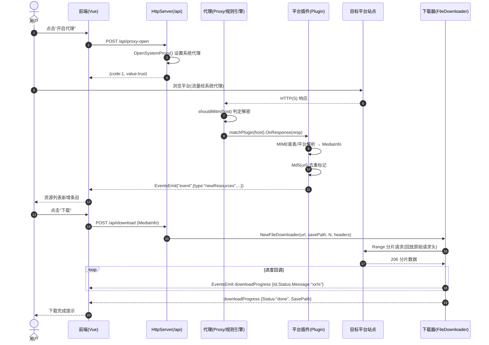
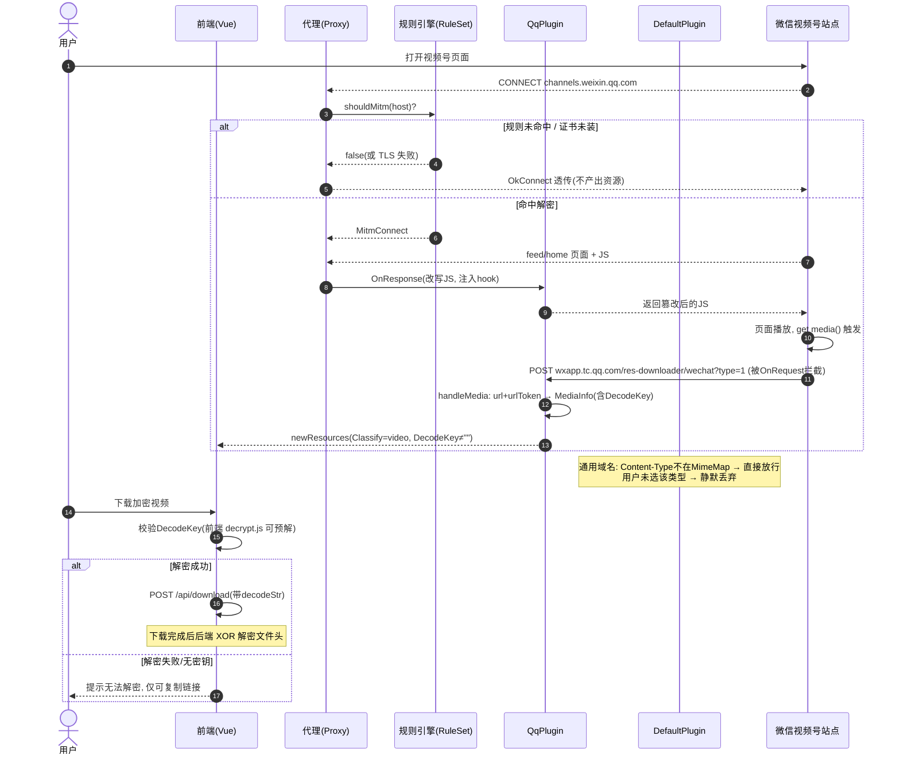
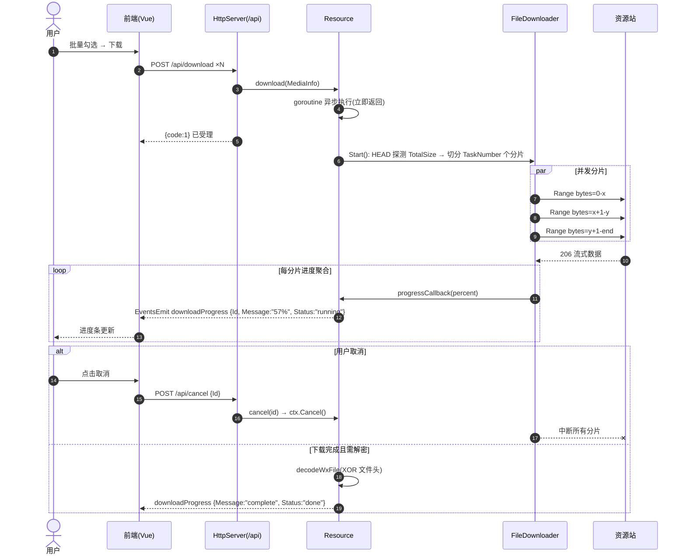
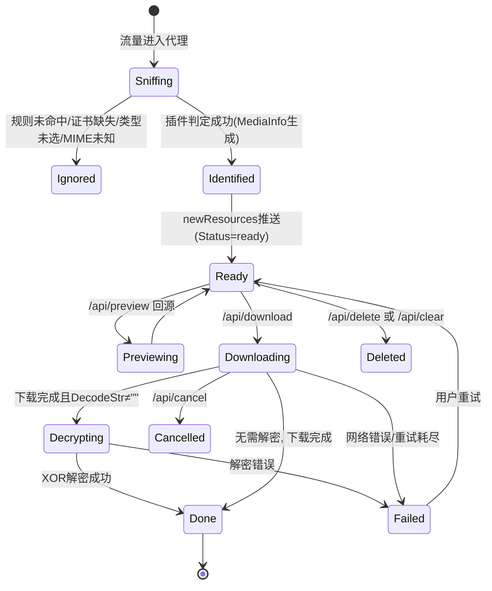

# res-downloader 交互方案设计稿

> **执行摘要**：本系统采用「本地代理嗅探」而非「URL 解析」模式——应用在本机 `127.0.0.1:8899` 同时承载 HTTP API 与 MITM 代理，浏览器流量经代理由「规则引擎 + 平台插件」判定资源并推送前端；实际下载链接在代理响应拦截（通用）或注入 JS 回传平台私有数据（微信视频号）时获得。本文给出端到端交互流程、判定机制详解、三个场景的 Mermaid 时序图与资源状态机。

---

## 1. 系统定位与总体交互模型

res-downloader 是 Wails 桌面应用（Go 后端 + Vue3 前端）。与"用户粘贴链接 → 服务端解析"的模式不同，它的核心是 **流量嗅探（sniffing）**：

- 单端口复用：`HttpServer.run()`（core/http.go）监听 `127.0.0.1:8899`，按 `Host` 分流——`Host == 127.0.0.1:8899` 走本地 API（`HandleApi`），其余全部交给 `goproxy` 代理转发。
- 前端与后端通信：前端 axios（frontend/src/api/request.ts → api/app.ts）调用 `/api/*`；后端 → 前端通过 Wails 事件 `runtime.EventsEmit(ctx, "event", ...)`（core/http.go `send()`），事件类型包括 `newResources`、`downloadProgress`。
- Wails Bind 层（core/bind.go）仅保留 `Config() / AppInfo() / ResetApp()` 三个辅助方法，主链路不走 Bind。

```
用户浏览器/系统应用 ──(系统代理 127.0.0.1:8899)──> HttpServer ──Host 分流──> /api/*（本地控制面）
                                                       │
                                                       └──────> goproxy MITM ──> 目标平台站点
                                                                │
                                                                ├─ 规则引擎（shouldMitm）
                                                                └─ 平台插件（OnRequest/OnResponse）
                                                                        │
                                                                        └─ EventsEmit ──> Vue 前端资源列表
```

---

## 2. 端到端用户旅程

| 阶段 | 用户动作 | 系统处理（代码出处） | 输出 |
|---|---|---|---|
| 1. 初始化 | 首次启动应用 | `App.Startup` 启动 HttpServer；前端调用 `/api/install` 安装 CA 根证书（`installCert`，写入 `install.lock`） | 证书入系统信任库 |
| 2. 开启拦截 | 点击"开启代理" | `/api/proxy-open` → `OpenSystemProxy()` 设置系统代理指向 8899；`/api/is-proxy` 查询状态 | 系统流量进入代理 |
| 3. 浏览平台 | 在微信/网页正常浏览 | 代理按 `RuleSet.shouldMitm` 决定是否解密 TLS；命中域名的响应进入插件 `OnResponse` | 透明转发 |
| 4. 资源入列 | （无操作，自动） | 插件判定资源 → 构造 `MediaInfo` → `Send("newResources", res)` → 前端列表新增条目 | 资源卡片（类型/大小/封面/描述） |
| 5. 预览/筛选 | 点击预览、按类型过滤 | `/api/preview?url=...` 后端回源拉流并透传 Range；`/api/set-type` 设置过滤类型集 | 在线播放 / 列表过滤 |
| 6. 下载 | 点击下载/批量下载 | `/api/download`（body 为 MediaInfo）→ 文件名规范化 → 微信系画质处理 → `FileDownloader` 多协程分片下载 → 进度事件 `downloadProgress` | 本地文件 |
| 7. 解密（可选） | 视频号加密资源 | 下载完成后若带 `DecodeStr`，`decodeWxFile` 对文件头做 XOR 解密；或 `/api/wx-file-decode` 对本地已存文件解密 | `_decrypt.mp4` |
| 8. 导出/清理 | 批量导出链接、清空列表 | `/api/batch-export` 写 txt 到下载目录；`/api/clear`、`/api/delete` 清理 `mediaMark` | 链接清单 / 列表清空 |

---

## 3. 资源内容判定机制（如何"判断资源内容"）

判定是**多级漏斗**，全部发生在代理响应链路上：

### 3.1 第一级：域名级 MITM 决策（core/rule.go）
- 用户可配置规则文本（默认 `*`），支持三种行语法：`example.com`（精确）、`*.example.com`（通配含子域）、`!xxx`（否定）、`*`（全部）。
- `shouldMitm(host)` 顺序求值，后命中覆盖先命中，返回 `true` 才做 TLS 中间人解密；否则 `OkConnect` 透传（看不到内容，自然无法判定资源）。

### 3.2 第二级：平台识别（core/proxy.go）
- `matchPlugin(host)`：取顶级域 `GetTopLevelDomain(host)` 查 `pluginRegistry`（init 时按插件 `Domains()` 注册）。当前注册：`qq.com → QqPlugin`，`default → DefaultPlugin` 兜底。
- 未命中任何平台插件时走 `DefaultPlugin`，即"全站通用嗅探"。

### 3.3 第三级：内容类型判定
**通用路径（DefaultPlugin.OnResponse）**：
1. 状态码过滤：仅 `200 / 206 / 304`。
2. MIME 查表：`Config.typeSuffix(Content-Type)` 在 `MimeMap`（约 70 条默认映射，config.go）中查出 `(classify, suffix)`——classify ∈ `image / audio / video / live / m3u8 / pdf / ppt / xls / doc / font / stream`。
3. 后缀兜底：`suffix == "default"`（如 `application/octet-stream`）时从 URL 路径取扩展名。
4. 用户过滤：`GetResType("all")` 或 `GetResType(classify)`，与前端 `/api/set-type` 选择的类型集求交。
5. 去重：`urlSign = Md5(url)`，`MediaIsMarked` 已标记则跳过；否则 `MarkMedia` 并推送。

**平台私有路径（QqPlugin，微信视频号）**：
- Content-Type 为 video 且 Host 为 `finder.video.qq.com`：直接判定为视频（来自公众号 mp.weixin.qq.com 的除外，主动忽略）。
- 对 `channels.weixin.qq.com` 的 feed/home 页面与 `res.wx.qq.com` 的指定 JS 做**响应体改写**（`replaceWxJsContent` / 正则注入），把版本参数换成应用版本号、并钩入 `get media()` 与 `finderGetCommentDetail` 两个函数——页面自身运行时把 `objectDesc`（含 `media[].url + urlToken + decodeKey + spec[].fileFormat`）POST 到伪 URL `https://wxapp.tc.qq.com/res-downloader/wechat?type=1|2`。
- 该请求被 `QqPlugin.OnRequest` 拦截（不真正出网），`handleMedia` 解析 JSON 生成 MediaInfo：`Classify=video/image`（`mediaType==9` 判为图片），`DecodeKey`、`Description`、`wx_file_formats`（清晰度列表）一并入库。

### 3.4 判定失败/降级的兜底策略
| 失败点 | 行为 |
|---|---|
| 未安装 CA 证书 | HTTPS 无法 MITM，该域流量透传，不产出资源（页面安装引导） |
| 规则未命中域名 | 透传不解密，不判定（性能与隐私保护） |
| MIME 不在 MimeMap | `classify == ""`，直接放行不推送 |
| 用户未选该类型 | 静默丢弃（不推送、不标记——注意：`DefaultPlugin` 是先判类型后标记） |
| 重复 URL | `mediaMark` 命中，跳过 |
| 视频号 type 与 `WxAction` 配置不符 | 返回空响应 `The content does not exist`，不处理 |

---

## 4. 实际下载链接的获取路径

| 路径 | 适用场景 | 机制 | 代码 |
|---|---|---|---|
| A. 响应头直取 | 通用直链（图片/音频/普通 mp4/文档） | 拦截响应时 `resp.Request.URL` 即为真实下载地址，原请求头整体 JSON 序列化存入 `OtherData["headers"]`，下载时回放 | plugin.default.go |
| B. 平台数据回传 | 微信视频号 | 注入 JS 使页面回传 `objectDesc`；真实地址 = `media[0].url + urlToken`（含 `encfilekey`/`token` 签名参数） | plugin.qq.com.go `handleMedia` |
| C. 画质/清晰度变换 | 视频号多码率 | `Quality==1` 且 URL 含 `encfilekey&token`：裁剪 query 仅保留两参数取原画；`Quality>1`：按 `wx_file_formats`（`spec[].fileFormat`）追加 `X-snsvideoflag=<format>` | resource.go `download()` |
| D. 解密后置 | 视频号加密流 | 链接本身可直接下载，但内容为加密态；下载完成后以 base64(DecodeKey) 与文件头逐字节 XOR 还原 | resource.go `decodeWxFile` |
| E. 预览代理 | 前端在线预览 | `/api/preview?url=` 由后端回源，透传 `Range`，规避浏览器 CORS/Referer 限制 | http.go `preview()` |

> 注意：本项目**没有**"静态页面解析 / 无头浏览器渲染 / API 逆向签算"这三类传统解析路径；它用 MITM + JS 注入达到了同等目的，且无需维护签名算法。

---

## 5. 业务流程时序图

### 5.1 场景一：正常流程（开启代理 → 嗅探 → 入列 → 下载）



### 5.2 场景二：异常与分支（未命中 / 加密资源 / 视频号注入回传）



### 5.3 场景三：异步流程（大文件分片下载 + 进度推送 + 取消）



---

## 6. 资源状态机



**状态说明**

| 状态 | 进入条件 | 出口 |
|---|---|---|
| Sniffing | 响应进入 OnResponse | 判定成功 → Identified；任一漏斗拦截 → Ignored |
| Identified | MediaInfo 构造完成且通过类型过滤与去重 | `MarkMedia` 后推送 → Ready |
| Ready | 前端展示（`shared.DownloadStatusReady`） | 下载 / 预览 / 删除 |
| Downloading | `/api/download` 受理，分片进行中（`DownloadStatusRunning`） | Done / Failed / Cancelled |
| Decrypting | 下载完成且带 `decodeStr` | Done / Failed |
| Done | `DownloadStatusDone`，SavePath 落盘 | 终态（可 open-folder 查看） |
| Failed / Cancelled | 错误事件 / 用户取消 | 重新下载回 Ready 语义 |

---

## 7. 关键设计观察

1. **单端口双职责**：8899 同时是控制面（/api）与数据面（代理），依赖 `Host` 头分流——简洁但意味着 API 无鉴权，任何能访问 127.0.0.1:8899 的本机进程均可调用。
2. **判定与下载解耦**：嗅探阶段只记录 URL 与元数据，带宽开销为 0；真正下载由用户显式触发，且回放原始请求头（含 Cookie/Referer），兼容防盗链。
3. **平台扩展点清晰**：新增平台 = 实现 `shared.Plugin` 接口 + 注册域名，Bridge 提供全部所需宿主能力（配置、去重、类型表、事件推送）。
4. **去重键是 `Md5(URL)`**：同一 URL 不同会话参数（如 token 轮换）会被视为不同资源；清空列表（/api/clear）后同资源可再次入列。
